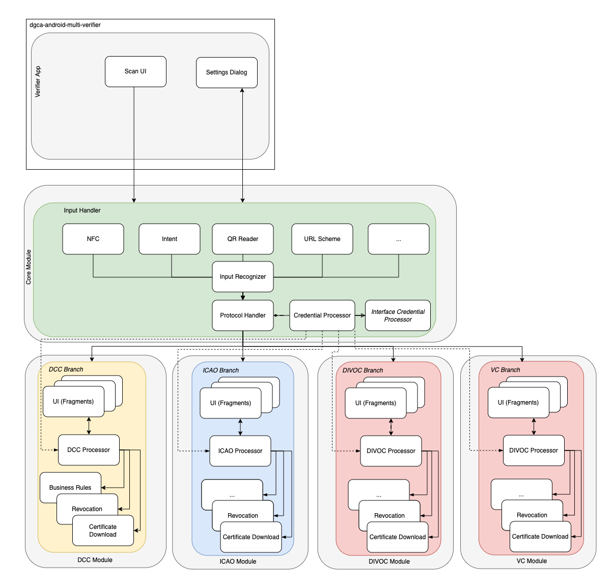
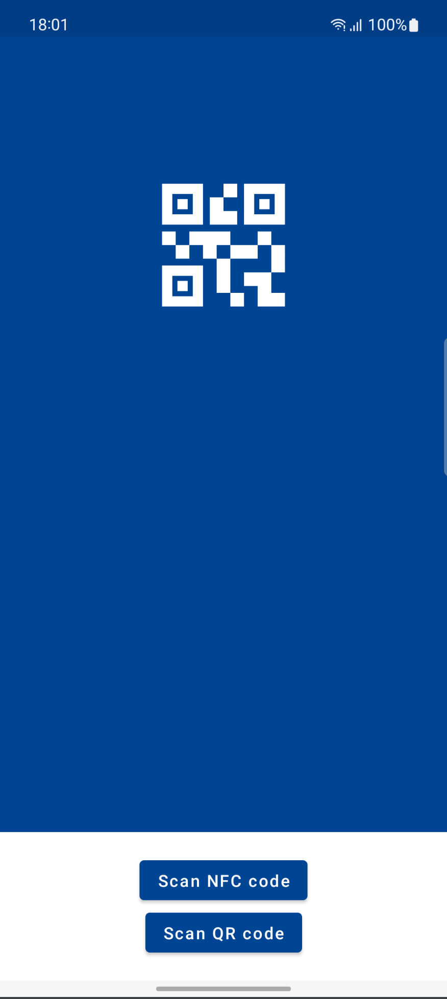
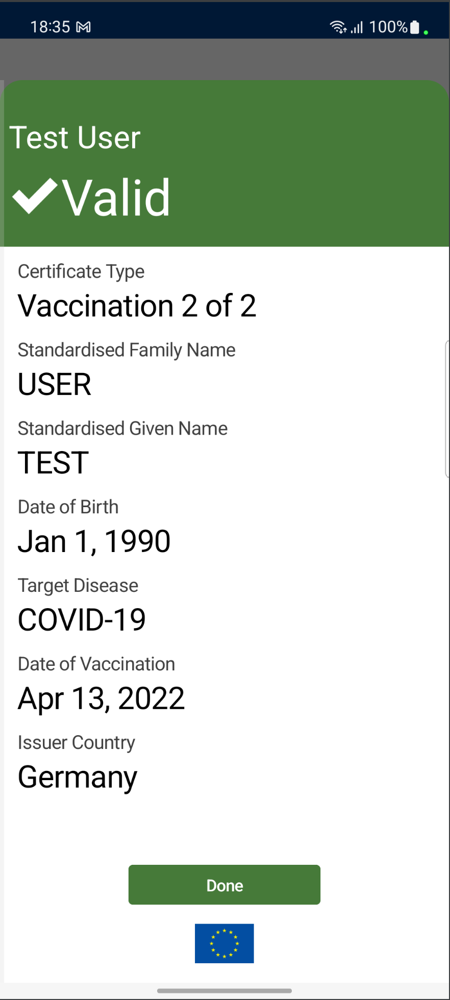
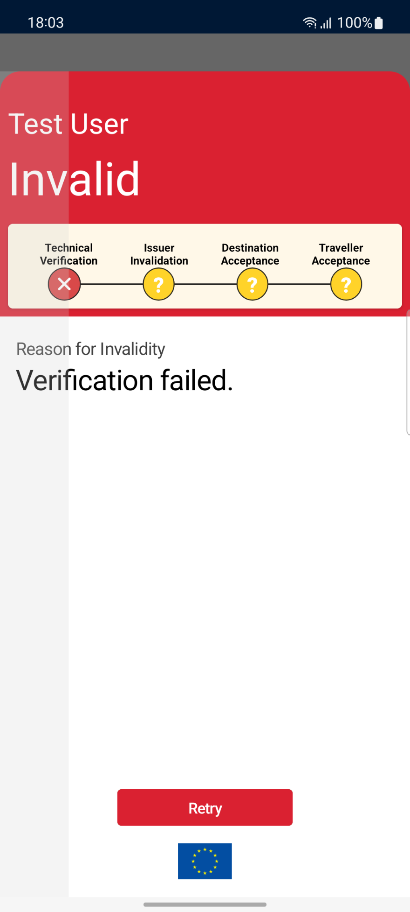
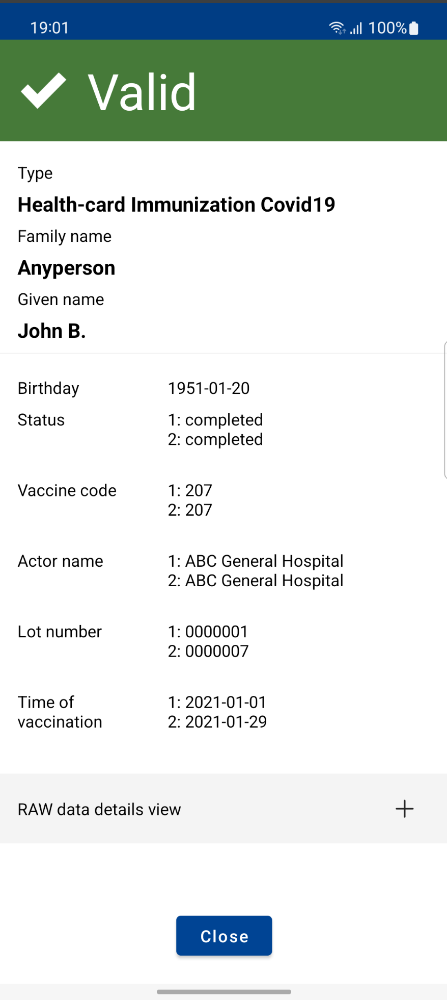

<h1 align="center">
    Verifier App Architecture
</h1>

The verifier app provides functionality to verify DCCs and Verifiable credentials. It verifies the signature with the keys provided by the verifier app’s backend. The app uses only open-source libraries. All DCCs and other types of certificates scanned or processed are ephemeral and will not be stored.

App architecture is created in a modularized way so new types of certificates can be easily added. 

## Main modules of the app 

### App module

Main application module. Entry point of the app and it contains `input recognition`  logic. 
Input data can be provided by: 

- NFC ([Wallet app](https://github.com/eu-digital-green-certificates/dgca-wallet-app-android) can share DCC codes.)
- Intent 
- QR code scanning

Main app view provides possibility to scan QR code or receive it by NFC. Processed input passed to one of branch module that can handle it.

### DCC module

Provides functionality to verify DCCs. It decodes the base45-encoded QR code, extracts the COSE signature, and decodes CBOR back to JSON. It then verifies the signature with the keys provided by the verifier app’s backend.
App also downloads the revocation information and processes it during the validation process in order to determine whether the given DCC has been revoked or not.

Verifier app workflow during verification:
- Scanning QR code
- Prefix validation: Drops a country-specific prefix from contents, e.g. "HC1:"
- Base45 Decoding: decodes provided input according to specification: [Base45](https://datatracker.ietf.org/doc/draft-faltstrom-base45/?include_text=1)
- Decompression with ZLIB
- Decodes input according to COSE specification [RFC8152](https://datatracker.ietf.org/doc/html/rfc8152)
- Decodes input as a [CBOR structure](https://datatracker.ietf.org/doc/html/rfc7049)
- Schema validation - verifies CBOR with predefined schema (JsonSchema.kt#JSON_SCHEMA_V1)
- Verifies COSE signature
- Revocation check

All codes are scanned with the open-source Zebra Crossing (zXing) Library. The decoding of the content is done by base45 decoding and CBOR libraries, with the COSE signature validation by Android-internal encryption libraries.

Verification result:

 

### VC module

In version 1.3 we introduced an enhancement for verifiable credentials according to the [W3C VC standard](https://www.w3.org/TR/vc-data-model/), which will allow the DCC verifiers to easily adopt other common digital health documents and certificates e.g. SMART Health Cards (SMART/SHC), Co-WIN, ICAO VDS-NC, International Travel Health Certificate (ITHC) and others. In addition, the W3C VC support will enable the wallets to derive credentials and the verifiers to verify them in a secure way (for example to generate a verifiable credential from eID and DCC within the wallet).

### SHC module

Extension of VC functionality allows app to verify Smart Health cards.

Example of SHC verification result:

### DIVOC/ICAO modules

Examples of how easily app can adopt other types of certificates.
