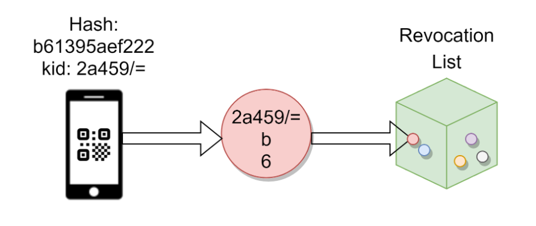

<h1 align="center">
    Revocation concept
</h1>

This concept is based on the following assumptions:
- All uploaders/downloaders of the revocation list batch data are connected to the EU DCC Gateway
- Maximum amount of DCC revocation entries are 80 Million (worldwide)
- Apps should be able to download incrementally without the need to sync entire lists
- The apps should be able to decrypt and verify the downloaded lists
- Revocation must be processable offline on verifier devices

The validation app downloads the revocation information and processes it during the validation process in order to determine whether the given DCC has been revoked or not.

This concept covers following Use Cases:
- The validation app updates its local revocation list data storage
The validation app queries the country-specific instance of the Revocation Data Service on a regular basis(every 24 hours), loads all changes of the revocation list (from all participating countries) and updates its local data storage. It optimises the storage for efficient access.
- The validation app checks whether a scanned DCC has been revoked
Within the DCC validation process the validation app queries its own local revocation list data storage in order to determine whether the given (scanned) DCC has been revoked or not.
- The validation app deletes the expired revocation entries from the local data storage
The validation app deletes all expired revocation entries from its own local revocation list data storage on a regular basis. It optimises the storage for efficient access.

Solution

The revocation of single DCCs can result in a very big amount of data. When millions DCC revocation entries are handled at global scale, normal lists with simple hashes can quickly reach hundreds of megabytes. This concept guarantees the offline capabilities for revocation considering both: efficient access to revocation data and the size of the revocation lists data storage. The following chapters describe patterns which help to partition the revocation lists and to speed up the revocation lookup. 

Revocation Entry Lookup

The core question is how to find a revocation entry in an efficient way. For this kind of problem an effective pointing method must be introduced to avoid a delay of the verification process. For instance, during a scan of 1000 people, a delay of 6 seconds means 100 min more delay on the entire process.  To save this time, the lookup mechanism must be optimised (striving to achieve O(log(n)) access) and avoid a linear search complexity (O(n)) depending on the amount of items. To achieve this goal, the DCC will be used as the basis for the point by using the KID as entrypoint, and the first and the second byte of the revocation entry (hash) as coordinates to identify where the revocation entry must be located.

